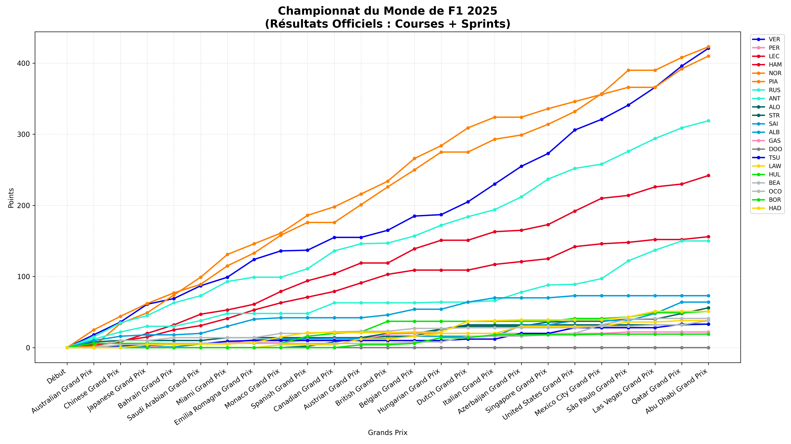

# 🏎️ F1 2025 Analysis - Robin's Dashboard

This project utilizes the **FastF1** library to extract, process, and visualize data from the 2025 Formula 1 season.

## 📊 Features
* Generates the cumulative World Championship standings (Grand Prix + Sprint races).
* Visualizes drivers' championship points evolution over the season.
* Integrates official team color schemes for accurate visualization.

## 🚀 How It Works
The main script `2025.py` fetches data via the Ergast/FastF1 API and generates a high-resolution chart.

## 📸 Overview

---
*A personal project developed as part of my Python learning journey.*